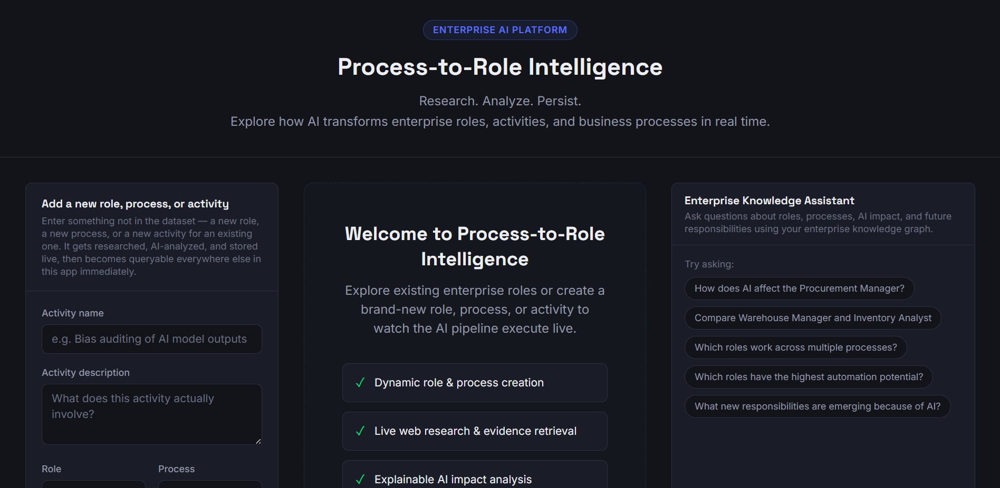
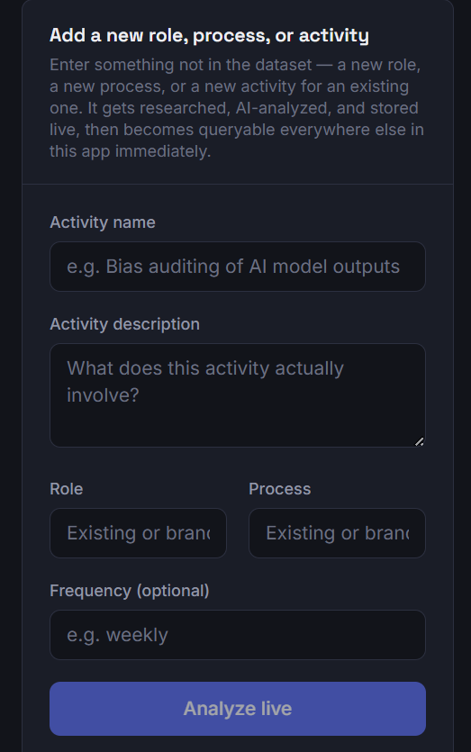
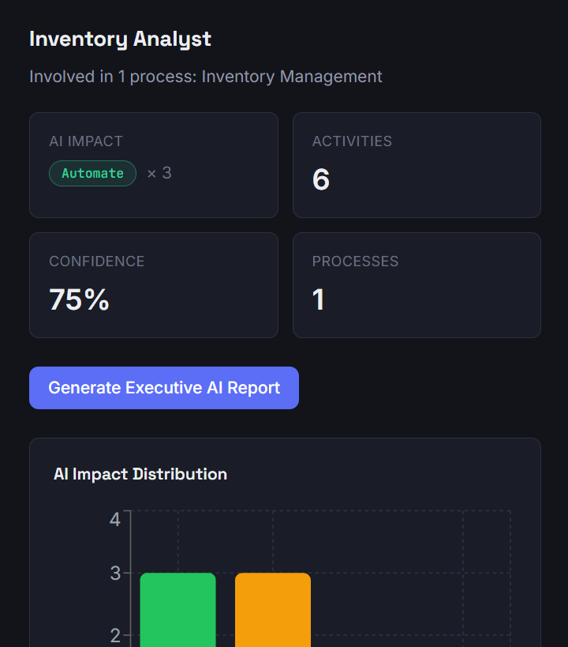
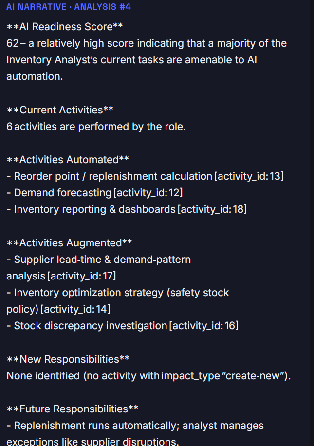
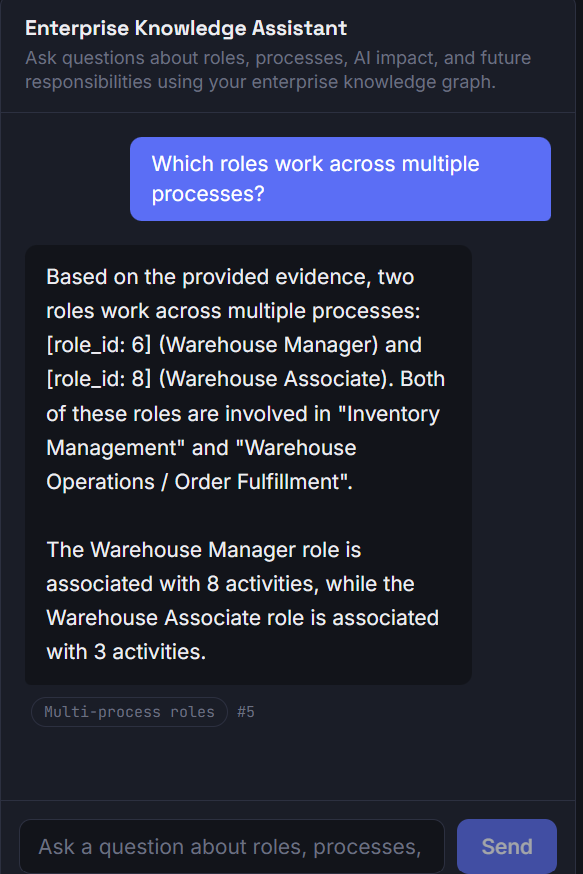

# Process-to-Role Intelligence

> **Enterprise AI platform for analyzing how Artificial Intelligence transforms business processes, activities, and organizational roles.**


---

# Overview

Process-to-Role Intelligence is an Enterprise AI application that helps organizations understand how AI impacts business roles by modeling the relationship:

```
Process → Activity → Role → AI Impact
```

Instead of acting as a generic chatbot, the platform builds a persistent enterprise knowledge graph where every activity is linked to its process, responsible role, AI impact, evidence, and future responsibilities.

The platform also supports **dynamic enterprise knowledge creation**. Users can introduce completely new roles, processes, and activities during runtime, which are researched, analyzed, stored, and immediately become part of the knowledge graph.

---

# Key Features

### Dynamic Enterprise Knowledge Creation

- Create new enterprise roles
- Create new business processes
- Create new activities
- Automatic database persistence
- Immediate integration into the reasoning engine

---

### Explainable AI Impact Analysis

Each activity is classified into one of four enterprise AI impact types:

- Automate
- Augment
- Create New Responsibility
- Eliminate

Every prediction includes:

- Automation Potential
- Confidence Score
- Executive Rationale
- Future Responsibility
- Research Evidence

---

### Enterprise Knowledge Assistant

The built-in assistant answers questions such as:

- How AI affects a role
- Compare two roles
- Which activities will be automated?
- Which roles work across multiple processes?
- Future responsibilities created by AI

Unlike a traditional chatbot, responses are generated using the deterministic reasoning engine before being narrated by an LLM.

---

### Executive AI Reports

Generate executive reports containing:

- AI Readiness Score
- Activity analysis
- AI impact distribution
- Future responsibilities
- Executive recommendations

---

### Live Research

New activities are enriched through live web research before AI analysis.

If research is unavailable, the system gracefully falls back to deterministic reasoning.

---

# Architecture

```
                    React + Tailwind CSS
                            │
                            ▼
                     FastAPI Backend
                            │
      ┌─────────────────────┼─────────────────────┐
      ▼                     ▼                     ▼
Deterministic       Research Service      LLM Narration
Reasoning Engine
      │
      ▼
 SQLite Enterprise Knowledge Graph
```

---

# Project Structure

```
Process-to-Role-Intelligence/
│
├── backend/
│
├── frontend/
│
├── docs/
│
└── README.md
```

---

# Technology Stack

## Frontend

- React
- Tailwind CSS
- Recharts

## Backend

- FastAPI
- SQLAlchemy
- SQLite
- Pydantic

## AI

- Ollama
- Groq
- OpenRouter

## Research

- DuckDuckGo Search

## Testing

- Pytest

---

# AI Pipeline

```
User Input
     │
     ▼
Live Research
     │
     ▼
Reasoning Engine
     │
     ▼
AI Impact Generation
     │
     ▼
Persistence
     │
     ▼
Enterprise Knowledge Graph
     │
     ▼
Dashboard + AI Assistant
```

---

# Demo Flow

1. Create a brand-new enterprise role
2. Add a new process and activity
3. Perform live research
4. Generate AI impact assessment
5. Persist data into SQLite
6. View updated dashboard
7. Generate Executive AI Report
8. Ask questions using the Enterprise Knowledge Assistant

---

# Highlights

- Dynamic enterprise knowledge graph
- Explainable AI
- Live research integration
- Executive AI reports
- Deterministic reasoning engine
- Multi-model LLM fallback
- Enterprise conversational assistant
- Persistent SQLite storage

---

# Repository Structure

```
frontend/
│
├── React UI
├── Dashboard
├── Chat Widget
└── Surprise Record Form

backend/
│
├── FastAPI APIs
├── Deterministic Reasoning
├── Research Engine
├── AI Synthesis
├── SQLite Database
└── Tests
```

---

---

# 📸 Application Screenshots

## 🏠 Home Page

<p align="center">
  
</p>

The landing page introduces the platform and provides access to the live enterprise AI workflow.

---

## 🚀 Live Knowledge Ingestion

<p align="center">
  
</p>

Users can dynamically create new enterprise roles, processes, and activities. The platform performs live research, generates AI impact assessments, persists the data, and immediately integrates it into the knowledge graph.

---

## 📊 Role Intelligence Dashboard

<p align="center">
  
</p>

The dashboard provides:

- AI Impact Distribution
- Automation Potential
- Confidence Scores
- Activity Analysis
- Executive AI Reports
- Future Responsibilities

---

## 📈 Executive AI Report

<p align="center">
  
</p>

Generate executive-ready summaries that explain AI readiness, emerging responsibilities, and organizational impact.

---

## 🤖 Enterprise Knowledge Assistant

<p align="center">
  
</p>

The Enterprise Knowledge Assistant answers questions about roles, processes, AI transformation, and future responsibilities using the platform's deterministic reasoning engine and enterprise knowledge graph.

---

# Future Enhancements

- Authentication & RBAC
- Department analytics
- Role evolution timeline
- Process visualization
- Vector search
- Enterprise dashboards

---

# License

Developed as a **Minimum Viable Intelligence Product (MVIP)** for an Enterprise AI Hackathon.