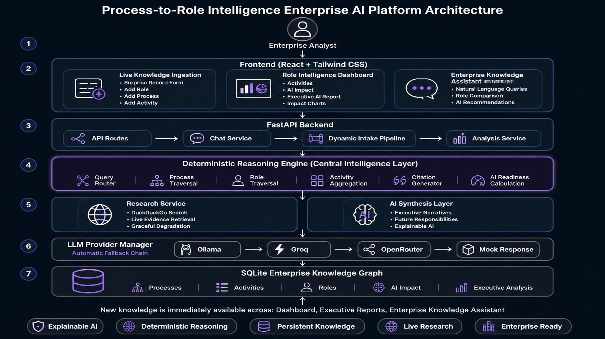

# System Architecture

## Overview

Process-to-Role Intelligence is an Enterprise AI platform designed to analyze how Artificial Intelligence transforms business processes, activities, and organizational roles.

The system combines deterministic reasoning, live research, and Large Language Models (LLMs) to generate explainable AI impact assessments while maintaining a persistent enterprise knowledge graph.

---

## System Architecture Diagram



---

# High-Level Architecture

```text
                                ┌──────────────────────────────┐
                                │        React Frontend        │
                                │                              │
                                │ • Role Dashboard             │
                                │ • Surprise Record Form       │
                                │ • Enterprise AI Assistant    │
                                └───────────────┬──────────────┘
                                                │
                                                │ REST API
                                                ▼
                     ┌──────────────────────────────────────────────────┐
                     │              FastAPI Backend                     │
                     └──────────────────────────────────────────────────┘
                                      │
      ┌───────────────────────────────┼───────────────────────────────┐
      ▼                               ▼                               ▼
┌──────────────┐              ┌──────────────┐                ┌──────────────┐
│ API Routes   │              │ Chat Service │                │ Dynamic Intake│
│              │              │              │                │ Pipeline      │
└──────┬───────┘              └──────┬───────┘                └──────┬───────┘
       │                              │                               │
       └──────────────┬───────────────┴───────────────┬───────────────┘
                      ▼                               ▼
              ┌─────────────────────────────────────────────┐
              │ Deterministic Reasoning Engine              │
              │                                             │
              │ • Query Router                              │
              │ • Role Traversal                            │
              │ • Process Traversal                         │
              │ • Activity Aggregation                      │
              │ • Citation Generation                       │
              └──────────────┬──────────────────────────────┘
                             │
              ┌──────────────┴──────────────────────────────┐
              ▼                                             ▼
     ┌─────────────────────┐                     ┌────────────────────┐
     │ Research Service    │                     │ AI Synthesis       │
     │                     │                     │                    │
     │ DuckDuckGo Search   │                     │ Ollama             │
     │ Graceful Fallback   │                     │ Groq               │
     └─────────────┬───────┘                     │ OpenRouter         │
                   │                             │ Mock               │
                   └──────────────┬──────────────┘
                                  ▼
                    ┌────────────────────────────┐
                    │ SQLite Knowledge Graph      │
                    │                            │
                    │ • Processes               │
                    │ • Activities              │
                    │ • Roles                   │
                    │ • AI Impact               │
                    │ • Analyses                │
                    └────────────────────────────┘
```

---

# Component Responsibilities

## Frontend

The React frontend provides three primary enterprise modules:

### 1. Live Knowledge Ingestion

Allows users to create entirely new enterprise knowledge by entering:

- Role
- Process
- Activity

The submission triggers live research, AI reasoning, persistence, and immediate integration into the platform.

---

### 2. Role Intelligence Dashboard

Displays:

- Activities
- AI Impact
- Automation Potential
- Confidence
- Future Responsibilities
- Executive AI Reports

The dashboard updates immediately when new knowledge is added.

---

### 3. Enterprise Knowledge Assistant

Supports natural language queries about:

- AI impact
- Role comparisons
- Multi-process roles
- Automation opportunities
- Future responsibilities

Responses are grounded in the deterministic reasoning engine before LLM narration.

---

# Backend Components

## API Layer

FastAPI exposes REST endpoints for:

- Roles
- Processes
- AI Analysis
- Dynamic Intake
- Enterprise Chat

The API layer contains no business logic and delegates work to service modules.

---

## Deterministic Reasoning Engine

This is the core intelligence layer.

Responsibilities include:

- Role traversal
- Process traversal
- Activity lookup
- Question routing
- Citation generation
- Evidence aggregation

No Large Language Model is used during reasoning.

This guarantees consistent and explainable results.

---

## Research Service

Before generating AI impact, the platform performs live web research.

Responsibilities:

- Retrieve supporting evidence
- Extract relevant snippets
- Provide citations
- Gracefully degrade when search is unavailable

---

## AI Synthesis

The AI synthesis layer converts structured reasoning into executive language.

Responsibilities:

- AI narratives
- Executive summaries
- Future responsibility descriptions

Business logic is never delegated to the LLM.

---

## Database Layer

SQLite stores:

- Processes
- Roles
- Activities
- AI Impact Assessments
- Executive Analyses

All user-generated records persist across application restarts.

---

# Dynamic Knowledge Pipeline

```text
User creates new Activity
            │
            ▼
Detect Role
            │
            ▼
Detect Process
            │
            ▼
Live Research
            │
            ▼
AI Impact Generation
            │
            ▼
Persist into SQLite
            │
            ▼
Knowledge Graph Updated
            │
            ▼
Dashboard + Chat immediately use new data
```

---

# AI Architecture

The platform intentionally separates reasoning from language generation.

## Deterministic Components

- Question routing
- Database traversal
- Role analysis
- AI impact aggregation
- Citation generation

These components never rely on an LLM.

---

## LLM Components

Large Language Models are responsible only for:

- Executive summaries
- Human-readable narratives
- AI report generation

This minimizes hallucinations while preserving explainability.

---

# LLM Fallback Strategy

To maximize reliability, the platform automatically switches between providers.

```text
             Ollama
                │
                ▼
              Groq
                │
                ▼
           OpenRouter
                │
                ▼
           Mock Response
```

Each fallback is logged to ensure uninterrupted operation.

---

# Design Principles

The architecture was designed around five enterprise AI principles:

- **Explainability** – Every AI conclusion traces back to specific activities.
- **Deterministic Reasoning** – Business logic is rule-based and reproducible.
- **Persistence** – New enterprise knowledge becomes a permanent part of the system.
- **Reliability** – Multi-model fallback ensures high availability.
- **Modularity** – Independent services simplify maintenance and future expansion.

---

# Future Architecture Enhancements

Potential future improvements include:

- PostgreSQL support
- User authentication & RBAC
- Department-level analytics
- Graph database integration
- Vector search
- Workflow orchestration
- Multi-tenant deployment