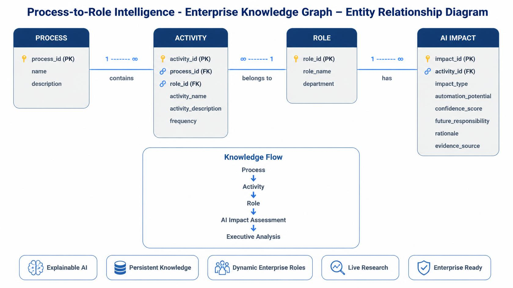

# Database Design

## Overview

The Process-to-Role Intelligence platform uses a relational SQLite database to model enterprise processes, activities, roles, and AI impact assessments.

The schema is designed around the relationship:

```
Process → Activity → Role → AI Impact
```

New knowledge created through the Surprise Record pipeline is persisted immediately, allowing it to become part of the enterprise knowledge graph without requiring application restarts.

---

# Entity Relationship Diagram



```text
                    Process
                ┌──────────────┐
                │ process_id PK│
                │ name         │
                │ description  │
                └──────┬───────┘
                       │ 1
                       │
                       │
                       │
                       │ ∞
                ┌──────▼────────┐
                │ Activity       │
                │─────────────── │
                │ activity_id PK │
                │ process_id FK  │
                │ role_id FK     │
                │ name           │
                │ description    │
                │ frequency      │
                └──────┬─────────┘
                       │
                       │ ∞
                       │
                       │ 1
                ┌──────▼────────┐
                │ Role           │
                │─────────────── │
                │ role_id PK     │
                │ name           │
                │ department     │
                └──────┬─────────┘
                       │
                       │1
                       │
                       │1
                ┌──────▼────────────┐
                │ AI Impact         │
                │────────────────── │
                │ impact_id PK      │
                │ activity_id FK    │
                │ impact_type       │
                │ confidence_score  │
                │ automation_score  │
                │ rationale         │
                │ future_role       │
                │ evidence_source   │
                └───────────────────┘
```

---

# Core Entities

## Process

Represents a business process.

Examples:

- Procurement
- Customer Support
- AI Governance

---

## Activity

Represents an individual task performed within a process.

Examples:

- Invoice Validation
- Model Bias Auditing
- Customer Complaint Resolution

Activities act as the bridge between processes and organizational roles.

---

## Role

Represents an enterprise job role.

Examples:

- Procurement Manager
- AI Ethics Officer
- Warehouse Manager

A role can participate in multiple activities across multiple business processes.

---

## AI Impact

Stores the AI assessment for each activity.

Includes:

- AI impact category
- Automation potential
- Confidence score
- Executive rationale
- Future responsibility
- Supporting evidence

---

# Dynamic Knowledge Creation

The Surprise Record pipeline allows runtime insertion of:

- New Processes
- New Roles
- New Activities

Each submission is:

1. Researched
2. Analyzed
3. Persisted into SQLite
4. Immediately available to the dashboard and chat assistant

No manual database updates are required.

---

# Design Principles

The schema was designed to provide:

- Normalized enterprise data
- Persistent knowledge storage
- Explainable AI reasoning
- Efficient role and activity traversal
- Support for dynamic enterprise knowledge creation